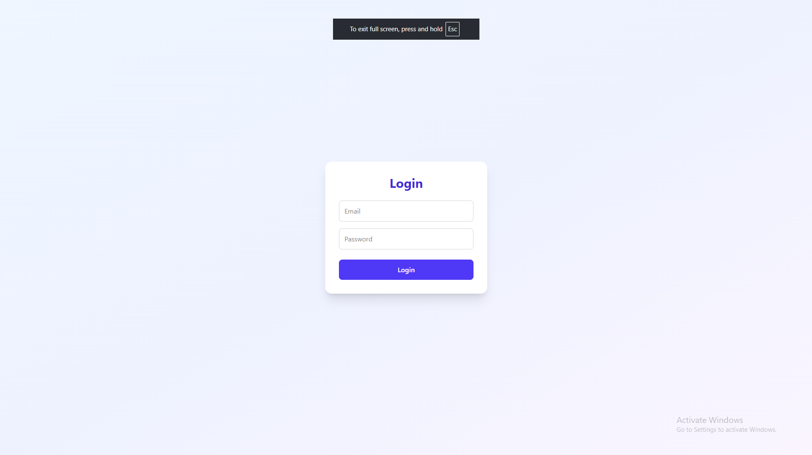
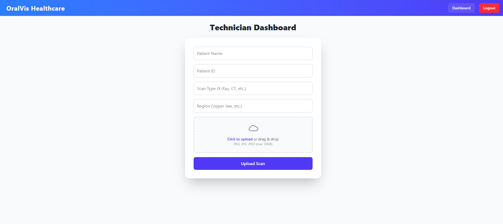
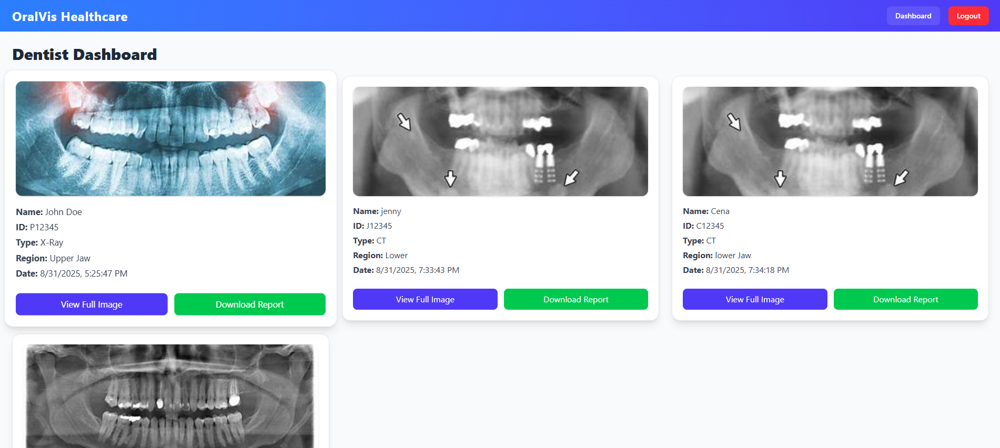
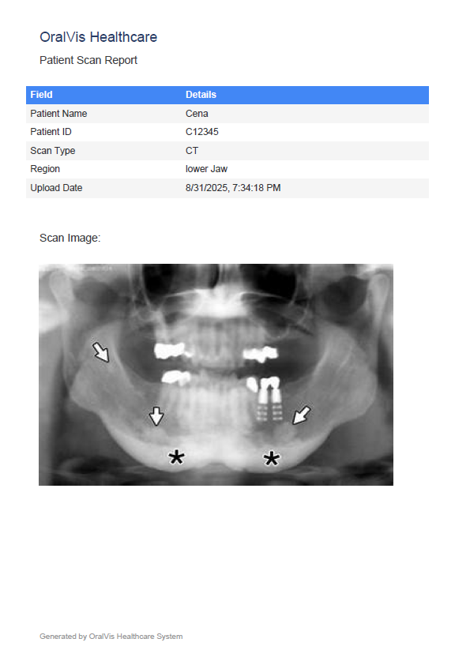

# OralVis - Dental Scan Management System

## Project Description
OralVis is a role-based web application designed for dentists and technicians to manage dental scans.  
- **Technicians** can upload patient scans with metadata (patient name, ID, scan type, region, and image).  
- **Dentists** can view all uploaded scans and download reports in PDF format.  
- Authentication is handled with JWT and role-based access control.  

This project was built as part of an assignment and demonstrates full-stack development with secure authentication and file handling.

---

## Technology Stack
- **Frontend**: React (Vite), TailwindCSS v4, axios, jsPDF  
- **Backend**: Node.js, Express.js, SQLite3, JWT authentication, bcrypt  
- **File Storage**: Cloudinary (for scan image uploads)  
- **Other Tools**: dotenv for environment variables, nodemon for development  

---

## Screenshots

### Login Page


### Technician Dashboard (Upload Scan)


### Dentist Dashboard (View & Download Scans)


### PDF (View & Downloaded Scans)


---

## Live Demo
[Live Demo Link](https://dentistscan-app.vercel.app/login)

---

## Running the Project Locally

### 1. Clone the repository
```bash
git clone https://github.com/Bhanukiran889/Dentistscan_app.git
cd oralvis
```
## 2. Backend Setup
```bash
cd oralvis-backend
npm install
```

### Environment Variables
Create a.env file in Oralvis-backend using the template:

.env.example
```bash
PORT=5000
JWT_SECRET=your_jwt_secret
CLOUDINARY_CLOUD_NAME=your_cloud_name
CLOUDINARY_API_KEY=your_api_key
CLOUDINARY_API_SECRET=your_api_secret
```

### start the backend server
```bash
npm run dev
```

## 3. Frontend Setup
```bash
cd oralvis-frontend
npm install
```

### Start the Frontend server
```bash
npm run dev
```
The frontend should now be running on http://localhost:5173

## Default Login Credentials
To make testing easier, use the following accounts:

### Techniaian

   * **Email**: tech@exm.com
   * **Password**: 123
### Dentist
   * **Email**: dentist@exm.com
   * **Password**: 123


## Features Implemented

* User Registration and Login (JWT-based authentication)
* Role-based Access Control (Technician and Dentist)
* Technician: Upload scans with metadata and images
* Dentist: View scans and download as PDF report
* Secure file upload to Cloudinary
* SQLite database for persistence


## API Documentation

### Authentication

#### POST `/api/auth/register`
Register a new user (Technician or Dentist).  
*(Used internally to create accounts, not part of the frontend flow.)*

**Request Body**
```json
{
  "email": "user@example.com",
  "password": "password123",
  "role": "Technician" 
}
```

### Response 
```bash
{
  "message": "User registered successfully",
  "userId": "generated-uuid"
}
```

### POST /api/auth/login

Login with email and password to receive a JWT.

### Request Body
```bash
{
  "email": "tech@exm.com",
  "password": "123"
}
```


### Response
```bash
{
  "token": "jwt_token_here",
  "role": "Technician"
}

```
### Scans
POST /api/scans/upload

Upload a scan (Technician only).

### Headers
```bash
Authorization: Bearer <JWT_TOKEN>
Content-Type: multipart/form-data
```

### Form Data
* patientName (string)
* patientId (string)
* scanType (string)
* region (string)
* scanImage (file)

### Response
```bash
{
  "message": "Scan uploaded successfully",
  "scanId": "generated-uuid",
  "url": "https://res.cloudinary.com/.../image.png"
}
```

#### GET /api/scans

Get all scans (Dentist only).

### Headers

```bash 
Authorization: Bearer <JWT_TOKEN>
```

### Response
```bash
[
  {
    "id": "uuid",
    "patientName": "John Doe",
    "patientId": "P123",
    "scanType": "X-Ray",
    "region": "Upper Jaw",
    "url": "https://res.cloudinary.com/.../image.png",
    "Date": "8-31-2025T5:25:47PM"
  }
]
```

### Notes

* All protected routes require Authorization: Bearer <token> header.
* Only Technicians can upload scans.
* Only Dentists can view scans.
* PDF report generation is handled on the frontend, not an API.

## Database Seeding

This project uses **SQLite** and is deployed on **Render (free tier)**.  
Since the database file is stored on the container’s ephemeral filesystem, **all data is wiped out whenever the server restarts** (cold start or redeploy).

To handle this, the app includes a **seeding script** (`seed.js`) that runs automatically on server startup.

### What the seeding script does
- Creates tables (`users`, `scans`) if they do not already exist.
- Inserts two default user accounts:
  - **Technician** → `tech@exm.com / 123`
  - **Dentist** → `dentist@exm.com / 123`
- Inserts demo scan records so the **Dentist dashboard** always displays sample data, even after a restart.

### Why this is necessary
Without seeding:
- On every restart, the database would be empty.
- Login would fail (no users exist).
- The Dentist dashboard would show nothing (no scans).

With seeding:
- Evaluators can immediately log in and test the app.
- Dentist can always view at least a couple of scans.
- Technician can log in and upload new scans during a session.

---

⚠️ **Note for evaluators:**  
Since this project is hosted on Render’s free tier, uploaded scans and user data will not persist forever.  
They may disappear after a restart or redeployment. This is expected behavior.
